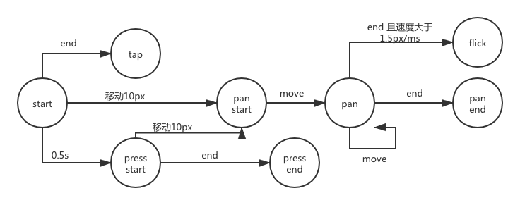

# 第15周笔记及作业

## Guesture

### 概念

1. 为了统一移动端和pc端
2. 为了提供一些方便的自定义事件，比如点击，长按，滑动（flick），移动

### 事件状态树

### 设计

1. 总共有3个类，Listener, Recognizer, Dispatcher;
2. Listener 负责监听鼠标的按下，移动，松开，以及移动端的点按移动松开，统一转化为Recognizer类的start move end cancel 等4个方法
3. Recognizer负责start,move,end的调用特征和状态转换图来识别是触发了什么事件，并且通过Dispatcher对象转发出去。
4. Dispatcher 负责在对应元素上派发自定义事件。

### Listener重点

1. 移动端的点击事件，可能有多个点被按下，所以要用一个contexts 列表来存同时被按下的点。
2. 移动端通过一个系统分配的identifer来区分不同的点
3. pc端通过event.button来区分不同的鼠标按键被按下（1～5）
4. event.buttons来存储当前按下的点，使用掩码的方式，所以要通过位运算来判断当前按下了哪些鼠标按键。
5. event.buttons的2 和 4 跟 event.button是反的。
6. 全局的监听/取消监听函数，需要做单例，避免重复取消和重复监听。

### Recognizer重点

1. 通过4个bool变量 来判断当前状态。isPan,isTap,isPress,isFlick. 当一个状态确定的时候 其他状态被置为false
2. 长按： 建立一个setTimeout 如果被触发，说明是长按，当转换到其他状态的时候，取消这个timeout
3. 移动： 第一次move时，如果当前移动值大于一个误差值（10px），则认为是一个移动事件，触发panstart事件，同时ispan置为true
4. N+1 次移动时，判断isPan是否为true， 是则触发pan事件
5. end触发时，如果isPan是true 则触发panend
6. 点击 整个流程没有改变任何state，则默认是tap事件
7. flick 保存一个最近0.5秒内 move的数组 如果数组不为空 且速度大于1.5px/ms 则认为是一个flick事件

### dispatch

1. 通过Event类，来派发事件，也可以使用CustomEvent
2. 注入给Recognizer， 让他来生成event，以及对应的数据
